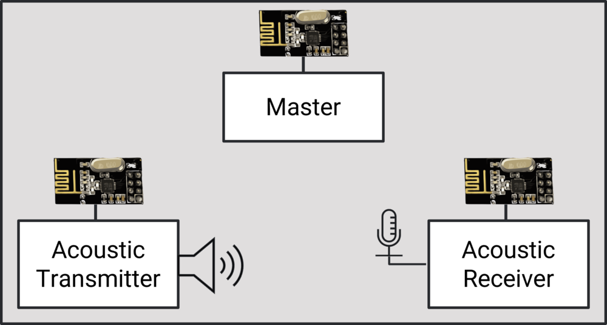
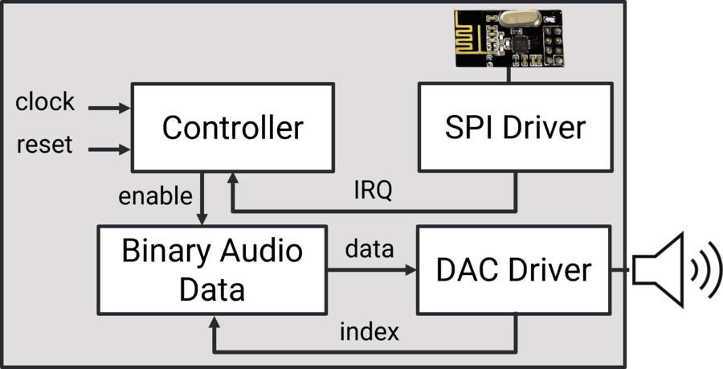
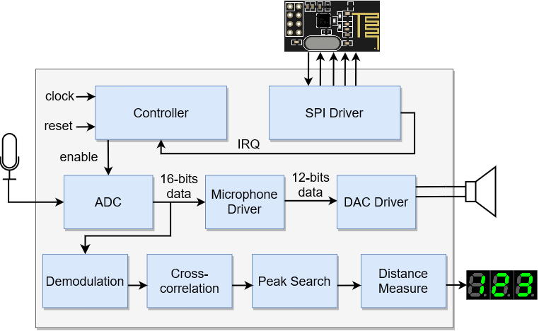
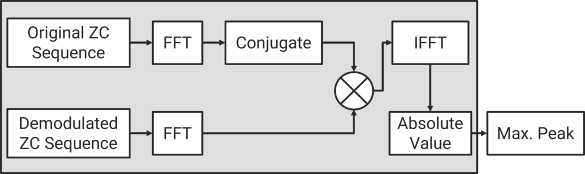

# FPGA acoustic ranging with Zadoff-Chu codes

Three Artix-7 FPGA boards measure distance by timing a coded sound burst. A master board fires a radio trigger, the transmitter plays a Zadoff-Chu (ZC) code on a 20 kHz carrier, and the receiver finds the code's arrival time by FFT cross-correlation in hardware.

Each distance measurement takes 25.6 ms, so the receiver delivers about 39 readings per second. With a wired link, readings from 0 to 1 m had under 5 mm mean error and about 2 mm spread.

The radio trigger starts the transmitter and receiver together, so the receiver knows when the burst left. Distance is the delay to the correlation peak times the speed of sound (343 m/s). Of each 25.6 ms measurement, 20.5 ms is the code itself, which leaves about 5 ms for everything else, including the FFT correlation.

This hardware is the real-time implementation for the MSc thesis *Integrated Sensing and Communication (ISAC) Design Scheme for Indoor Object Localization* by [Reema Al Nafisi](https://orcid.org/0009-0003-4985-5034) ([KAUST repository](https://repository.kaust.edu.sa/search?query=%22Design%20Scheme%20for%20Indoor%20Object%20Localization%22), March 2024). The block diagrams in this README are from that thesis.

## The boards

On the transmitter, the controller waits for the radio trigger over SPI, then streams the stored code to the DAC:

The receiver samples the microphone through the XADC, demodulates, correlates and turns the peak position into a distance:

The draw.io source for the receiver diagram is in `docs/diagrams/`.

## How the signal works

1. A ZC code has constant amplitude and a single sharp autocorrelation peak, so a short burst gives a precise arrival time even with noise. The design uses N = 16 chips of 256 samples each at 200 kHz.
2. The I and Q parts are mixed onto cosine and sine at 20 kHz and summed. Each new chip shifts the carrier phase.
3. The receiver mixes back down, low-pass filters, and cross-correlates with the stored code. It does the correlation as FFT, multiply by the conjugate FFT of the reference (`fftConj.coe`), then inverse FFT. The lag of the peak is the time of flight.

The signal-chain plot at the top of this section simulates a 1 m target with the parameters in `matlab/experiments/FPGA_Sim.m`. Below is the demodulation step on the real hardware, captured with the Vivado ILA in March 2023. `FIR_Output` is the demodulated code after the low-pass filter:

## Results

Bench tests from April 2023, 100 readings per distance. Raw readings are in `data/measurements/`, the analysis is `matlab/fpga_sim/uart_distance.m`, and the plots come from `docs/make_figures.py`. The plots stop at 1 m. The wired folder also has runs at 3, 5 and 7 m.

| Setup | Distances tested | Mean error | Std dev |
|---|---|---|---|
| Wired radio, wired audio | 0 to 1 m | 1.8 to 4.3 mm | 1.3 to 2.1 mm |
| Wireless radio, audio over air | 0.25 to 1 m | 1.3 to 3.5 cm | 8 to 26 mm |

Over the air the error grows to centimeters. Multipath, room noise and alignment of the speaker and mic all add to it. At 0.05 m wireless the error was 6 cm with a 64 mm std dev, and the wireless run at 0.1 m did not lock.

Every run has a few readings far from the rest. `uart_distance.m` drops readings more than 0.5σ from the mean (0.3σ for wireless) before averaging. That removes 1 to 3% of wired readings and 4 to 9% of wireless ones. Here is one wired run:

Without the filter, the std dev per run is 0.09 to 0.8 m wired and 0.8 to 1.8 m wireless.

Receiver utilization from the April 2023 build:

## How it got here

| Path | What it is | When |
|---|---|---|
| `hw/nrf_link` | nRF24L01+ SPI driver, controller, PWM tone, first all-in-one test design | Aug to Sep 2022 |
| `hw/master`, `hw/aco_tx`, `hw/aco_rx`, `hw/master_aco_rx` | First three-board system: radio sync, sine tone out, PDM microphone in, samples to the PC over UART | Sep 2022 |
| `host/python` | Serial capture, PDM to PCM conversion, WAV export for those boards | Sep 2022 |
| `data/sync_errors`, `docs/figures/clock_drift_*` | Sync error runs and plots of clock drift between the boards | Sep 2022 |
| `hw/aco_rx_eth` | Receiver that streams microphone samples over Ethernet, with a CIC decimator | Oct 2022 |
| `hw/zc_tx` | ZC transmitter through a Pmod DA2 DAC, frequency detection, SD card driver | Jan to Feb 2023 |
| `hw/fft_corr` | FFT cross-correlation and demodulation core with testbenches, three revisions | Feb 2023 |
| `hw/acorx` | Receiver with the correlator, XADC microphone input and radio | Feb 2023 |
| `matlab/zc_tools` | ZC sequence, modulation and demodulation table generators | Jan to Mar 2023 |
| `data/ila` | ILA captures from the receiver | Feb to Mar 2023 |
| `matlab/experiments` | Filter designs, `.coe` memory files for the FPGA, test scripts | Mar to May 2023 |
| `data/measurements` | Distance runs: bench 0 to 1 m, wired 0 to 7 m, wireless 0.05 to 1.5 m | Mar to Apr 2023 |
| `matlab/fpga_sim` | Fixed-point receiver model, UART readout, delay and std dev analysis | May 2023 to Mar 2024 |
| `bitstreams/2022-09` | Bitstreams for the September 2022 designs | Sep 2022 |

## Building

All designs target the XC7A100T (`xc7a100tcsg324-1`, Nexys A7-100T). The projects were made in Vivado 2019.2 to 2022.1. Only sources, constraints, block designs and IP configurations (`.xci`) are committed. Open the `.xpr`, let Vivado upgrade the IP, then generate output products before synthesis.

The notebooks in `host/python` need `numpy`, `scipy`, `matplotlib` and `pyserial`. The COM port is hard-coded at the top of each notebook. To redraw the README plots, run `python docs/make_figures.py`.

## Known gaps

The HDL for the receiver that produced the April 2023 measurements is not in this repo. The newest correlator source here is `hw/fft_corr` from 24 Feb 2023.

## Third-party code

These files keep their original headers and terms:

- `spi_master.vhd`, `uart.vhd`: Scott Larson, Digi-Key eewiki
- `crc_gen.v`, `packet_gen.sv`, `ethernet_header_pkg.sv` and the other Ethernet and PDM files in `hw/aco_rx_eth`: HDL for Beginners
- `microphone_driver.v` and the seven-segment modules: Digilent (Tudor Roxana-Ioana)
- `pmod_da2.vhd`: Afia Semin; `sd_driver.vhd`: Ben Wolsieffer (Dartmouth ENGS 31)

Authorship of every source file is in its header.

## License

MIT for the original code in this repo, see `LICENSE`. The third-party files above keep their own terms.
